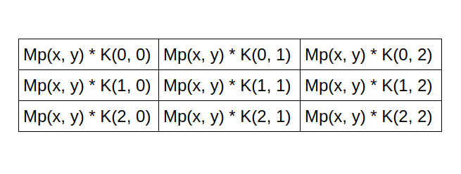
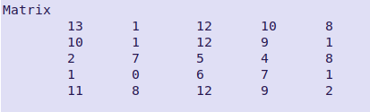
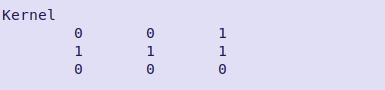
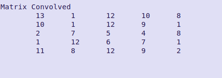
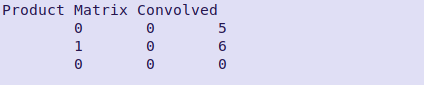

# Convulacao2D
O problema escolhido foi o Processamento de array, nele você encontra duas matrizes, a matriz principal e a outra matriz que recebe o nome de kernel. Elas executam uma convolução, onde uma é aplicada sobre a outra para gerar uma terceira como produto, modificando assim o resultado inicial. A matriz que sofre alteração, é a matriz principal, a de kernel é usada como auxiliar para que obtenha o produto desejado. Muito se usa, desse método para aplicar filtros em imagens, onde a imagem seria a matriz principal e o kernel seria o próprio filtro. Neste algoritmo isso é demonstrado de forma simples, os filtros que usam deste método para alterar as imagens são vários, alguns conhecidos são os de desfocagem, nitidez, mapas de relevo entre outros.
	O algoritmo apresentado, busca mostrar de forma simples e direta, uma convolução 2D de matrizes, ele quando iniciado gera uma matriz 5x5, com um kernel 3x3. Em convolução de matrizes são usados estes tamanhos para o kernel em uma imagem de matriz de número indeterminado, uma matriz 20x20, poderá receber um kernel de 5x5 ou 3x3, isso vai depender o desenvolvedor do filtro. Voltando a explicação, após iniciado o algoritmo e ele gerado as matrizes, ele irá começar a convolução. Uma convolução 2d em matrizes funciona desta forma, quando você aplica uma matriz acima da outra, elas irão obter uma terceira matriz de mesmo tamanho do kernel, onde os elementos dela são o resultado dos produtos do kernel aplicado acima da matriz principal, após isso, estes valores são somados e com isso você obtém o valor convolado do que foi desejado, como mostrado nas imagens abaixo: 

A terceira matriz que é gerada, é apenas usada para guardar o produto resultante da convolução de K(Kernel) em MP(Matriz Principal), pois cada elemento dessa terceira matriz é somada para que seja feito a alteração a MP, pois ela quem mostra a imagem, e que por consequência sofrerá uma alteração do filtro, a terceira matriz tem essa aparência, imagem abaixo: 

Note que MP, não contém valores, e sim variáveis X e Y, isso pois nunca se sabe aonde o filtro irá ser aplicado a matriz principal, por isso esses valores variam com o que o filtro precisa alterar na imagem original.
	Em meu algoritmo, configurei para que o kernel buscasse na matriz principal os zeros e assim fizesse a alteração deles conforme o filtro gerado randomicamente. Nas imagens abaixo apresenta-se uma matriz e o kernel gerada aleatoriamente pelo meu algoritmo:

Esses dois iram trabalhar um acima do outro para que os zeros sejam alterados, neste caso como a matriz é pequena, gerou apenas um zero, mas não tem problema, já é o suficiente para que o meu algoritmo consigo gerar algum resultado. Neste caso o resultado seria este: imagem abaixo

Como podemos perceber, agora o 0 virou um 12, isso pelas somas dos produtos da terceira matriz gerada pela convolução, imagem abaixo da terceira matriz:

E nisso temos uma simulação de um filtro sendo aplicado a uma imagem em um determinado pixel. 
